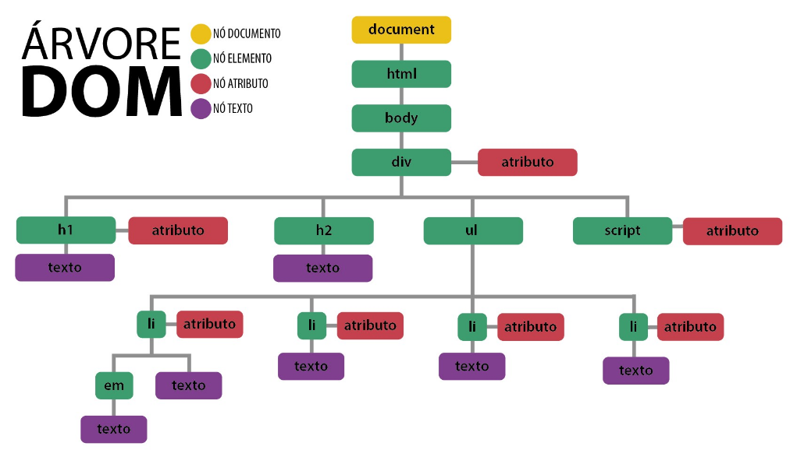

# JavaScript e o Navegador (Dom)

## Protocolos:

* Um protocolo é uma forma de comunicação entre computadores atraves da rede;
* O HTTP, serve para nós solicitarmos arquivos,imagens e etc (HYPER TEXT TRANSFER PROTOCOL);
* Entramos em sites graças ao protocolo HTTP;
* SMTP = Protocolo para enviar e-mail;
* TCP = Protocolo de transferência;

## URL

* Cada arquivo que carrega no navegador é nomeado por uma URL;
* A URL (Uniform Resource Locator) pode ser dividida em 3 partes, protocolo, servidor e arquivo;
* http://www.horadecodar.com.br/index.html
* http = protocolo;
* www.horadecodar.com.br = servidor (DNS para um IP);
* index.html = arquivo;

## OBS:

Podemos usar a chamada ao java script externo no html usando ele no final da pagina `:`

` <body>`

    no final do corpo:

    `<script src=""></script>`

`</body>`

OU no inicio usando o defer

```html
<head> <script src="" defer></script></head> <body> </body>
```

O defer ele serve para fazer que o javascript execute por ultimo no html;

## A Estrutura HTML e o DOM

* Quando uma página web é requisitada, ela ecebe um texto que é transformado em uma estrutura HTML;
* As tags vão se ninhando uma as outras, formando uma estrutura em que elementos ficam dentro de dos outros;
* Esssa estrutura tem uma representação exatamente igual para o JS chamado de DOM;
* Que significa Document Object Model;
* E por meio do JS podemos cessar cada um destes elementos do HTML através do DOM;

### O DOM

* Podemos mudar completamente uma página HTML através do DOM;
* É possivel alterar: elementos, atributos, css;
* Além de alterar podemos adicionar e remover;
* Além de ser possível criar eventos na página, como animações;

#### A arvore do Dom

* O documento HTML seria a árvore completa;
* A raiz da árvore é o Document(só uma raiz);
* Cada elemento da árvore chamamos de leaf nodes (as folhas)



#### Movendo-se Atraves do DOM

* Podemos acessar todos os elementos a partir de document.body;
* A partir dele vamos entrando nos childNodes;
* E depois acessando as propiedades que nos interessa;

```html
<!DOCTYPE html>
<html lang="pt-br">
<head>
    <meta charset="UTF-8">
    <meta name="viewport" content="width=device-width, initial-scale=1.0">
    <title>Teste</title>
</head>
<body>
    <div>
        <h1>Titulo pincipal</h1>
        <p>Algum texto</p>
    </div>
    <div>
        <h2>Lista de coisas a Fazer</h2>
        <ul>
            <li>Coisa 1</li>
            <li>Coisa 2</li>
            <li>Coisa 3</li>
        </ul>
    </div>

    <script src="teste.js"></script>
</body>
</html>
```

```js
console.log(document.body);
console.log(document.body.childNodes);
console.log(document.body.childNodes[1]);
console.log(document.body.childNodes[1].childNodes[1]);
console.log(document.body.childNodes[1].childNodes[1].textContent);
```

#### Encontrando elementos

* Podemos encontrar elementos de uma forma mais facil do que se movendo pelo DOM;
* Como no html temos tags, classes e ids, o javaScript nos possibilita utilizar estas características para encontrar o que desejamos;
* Há alguns metodos para isto: getElementsByTagName, getElementById, getElementByClassName e também o querySelector;
* Vamos ver cada um deles;

Abaixo segue alguns exemplos:

```js
/* encontrando elemento por tagName */
/*ele retornam uma collection*/
/*Talvez não use muito pois ele mexe com os elementos do dom, e queremos ser mais especificos */
/*
console.log(document.getElementsByTagName('h1'));
console.log(document.getElementsByTagName('p'));
console.log(document.getElementsByTagName('li'));
*/

/* encontrando elementyos por id */

/*console.log(document.getElementById('titulo'));*/

/* encontrando elemento por class */
/*console.log(document.getElementsByClassName('lista'));*/

/* Usando o querySelector */
console.log(document.querySelector('#titulo'));
console.log(document.querySelector('.lista'));
console.log(document.querySelector('p'));
```

#### Alterando o HTML:

* Podemos mudar quase tudo através do Dom;
* Adicionar,Remover e clonar elementos;
* Podemos utilizar metodos como: insertBeofore, appendChild e replaceChild;
* Vamos ver em detalhes como usar cada um destes;

##### Alterando o DOM com insertBefore

* Insere um nó antes do nó de referencia do método;
* Precisamos de um elemento para ser adicionado;
* O elemento que terá o outro elemento adicionado antes dele;
* E o elemento pai desses dois;

```js

<body>
     <div id="container">
         <h1 id="titulo">Testando</h1>
     </div>

    <script src="teste.js"></script>
</body>


let novoElemento = document.createElement("p");
let texto = document.createTextNode("Algum texto");//createTextNode é um no de texto.
novoElemento.appendChild(texto);//o appendChild para poder adicionar elementos
let elementoAlvo = document.querySelector("#titulo");
let elementoPai = document.querySelector("#container");

elementoPai.insertBefore(novoElemento, elementoAlvo);/*inserindo um paragrafo antes do titulo */
```

Ou seja crie um paragrafo, criei um nó de texto depois adicionei ao paragrafo e depois peguei o elemento pai chamei o metodo insertBefore passei o novo elemento que foi criado que vai ficar antes do elemento alvo que eu quero colocar antes.


##### Inserindo elementos com appendChild:

Adiciona um nó após todos os elementos do elemento pai especificado;

```js
<body>
   
     <div>
        <p id="p-principal"> bilom </p>
        <p>mais texto</p>
     </div>

    <script src="teste.js"></script>
</body>

let novoElemento = document.createElement("p");
let texto = document.createTextNode(" Lorem LoreLorem LoreLorem LoreL");/* createTextNode cria um texto */

novoElemento.appendChild(texto);

let p = document.querySelector("#p-principal");
let pai = p.parentNode;/* usando o parentNode ele faz com que eu pegue o pai do elemento
ou seja eu pegue a div que é o pai p-principal e adicione outro elemento dentro dela apos o 
elemento filho ficando sempre no final da fila*/

pai.appendChild(novoElemento);
```


##### Alterando a DOM com replaceChild

Repõe um antigo elemento no DOM, com um novo;

```js
<body>
   
     <div>
        <h1 id="titulo-principal"> ALgum Titulo </h1><!--trocando por um paragrafo-->
        <p>mais texto</p>
     </div>

    <script src="teste.js"></script>
</body>

let novoElemento = document.createElement("p");
let texto = document.createTextNode(" Lorem LoreLorem LoreLorem LoreL");/* createTextNode cria um texto */
novoElemento.appendChild(texto);

let titulo = document.querySelector('#titulo-principal');
let pai = titulo.parentNode;

pai.replaceChild(novoElemento, titulo);/*replaceChild(novo, antigo) */


```

Ou seja ele troca o elemento por outro novo.

##### Inserindo Texto nos elementos:

* Podemos criar um nó de texto puro e inserir em um elemento;

```js
<body>
   
     <div>
        <p id="p-paragrfo"></p>
     </div>

    <script src="teste.js"></script>
</body>


let texto = document.createTextNode("Jesus é o Caminho a verdade e a vida!");/*criei o texto */
let p = document.getElementById('p-paragrfo');/*peguei o paragrafo via id */
p.appendChild(texto);/*adicionei o texto dentro do paragrafo */

```


##### Criando nós de Elemento

* Podemos crar um nó de elemento com o CreateElement, e depois inserir no html

```js
let span = document.createElement("span");
let el = document.querySelector("h1");
let pai = h1.parentNode;

pai.insertBefore(span, el);
```

outro exemplo mais complexo:

html:

```html
<body>
     <div id="container">
       
     </div>

    <script src="teste.js"></script>
</body>
```

Js:

```js
let lista = document.createElement('ul');


for(i=0; i < 5; i++){
    let item = document.createElement('li');
    let texto = document.createTextNode('Texto lista' + ' - '+ i);
    item.appendChild(texto);
    lista.appendChild(item);
}

let container = document.querySelector('#container');
container.appendChild(lista);
```


##### Modificando e Lendo atributos

* Podemos resgatar o valor de um atributo ou trocar com o js;
* Por exemplo o href de um a ou src de um elemento de img;
* getAttribute pega o valor;
* setAttribute atualiza o valor

Um exemplo criando so o setAttribute:

```js
let container = document.querySelector('#container');
let imagem = document.createElement('img');

imagem.setAttribute('src','img/dom-img.png');
imagem.setAttribute('alt','imagem arvore dom');
imagem.setAttribute('width','550px');

container.appendChild(imagem);
```


Um exemplo usando o getAttribute:

```js
let a = document.querySelector('footer a');
console.log(a.getAttribute('href'));/*ele vai pegar o valor e exibir*/
```

Verificando altura e largura do elemento

* Com o js também é possvel verificar propiedades do elemento como altura e largura, veja;

```js
let container = document.querySelector('#container');

console.log('A largura: ' + container.offsetWidth + 'A altura ' + container.offsetHeight);//considera as bordas

console.log(container.clientWidth);//desconsidera bordas
console.log(container.clientHeight);// desconsidera bordas
```


##### Posição do elemento na tela

* Também é possivel checar a posição do elemento na tela;
* getBoundingClientRect nos da as posições de top,left,right,bottom do elemento e outras informações;

```js
let titulo = document.querySelector('#titulo');
console.log(titulo.getBoundingClientRect());
```


##### Estilizando com JS

* Podemos também mudar as propiedades de estilo dos elementos do html com o js;
* Acessando a propiedade style podemos fazer as modificações;
* O estilo é manipulado direto na tag, ou seja, substitui o do css na maioria das vezes;

```js
let titulo = document.querySelector('#titulo');

console.log(titulo.style);

titulo.style = 'color:red';//assim
titulo.style.color ='blue';// ou assim
```

##### Selecionar várioselementos com query

* Para selecionar diversos elementos com o query, podemos utilizar o metodo querySelectorAll;
* Em vez de um, podemos pegar todos os elementos semelhantes com o seletor do css;

Html:

```html
<body>
     <div id="container">
        <h1 id="titulo">Olar Mundo!</h1>
         <ul>
            <li class="itens-vermelho">Lista vermelha</li>
            <li class="itens-vermelho">Lista vermelha</li>
            <li class="itens-vermelho">Lista vermelha</li>
            <li class="itens-azul">Lista azul</li>
            <li class="itens-azul">Lista azul</li>
            <li class="itens-azul">Lista azul</li>
         </ul>

     </div>

    <script src="teste.js"></script>
</body>
```

Js:

```js
let itens = document.querySelectorAll('.itens-vermelho');

console.log(itens);

titulo.style.color = '';
for(i=0; i < itens.length;i++){
    itens[i].style.color ='red';
}
```
